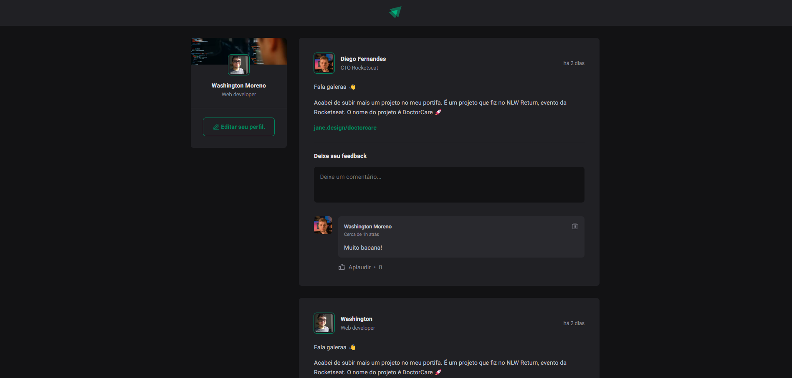
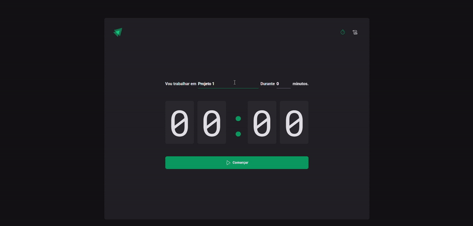
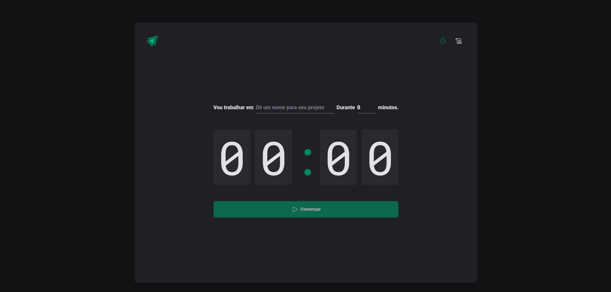
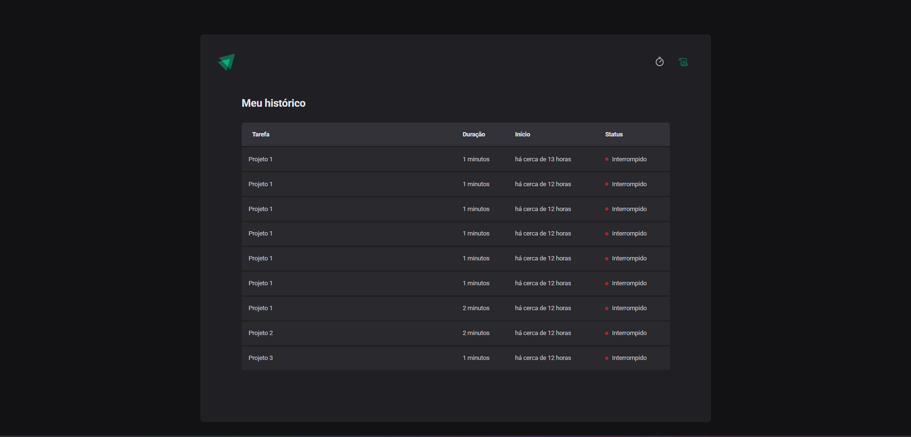
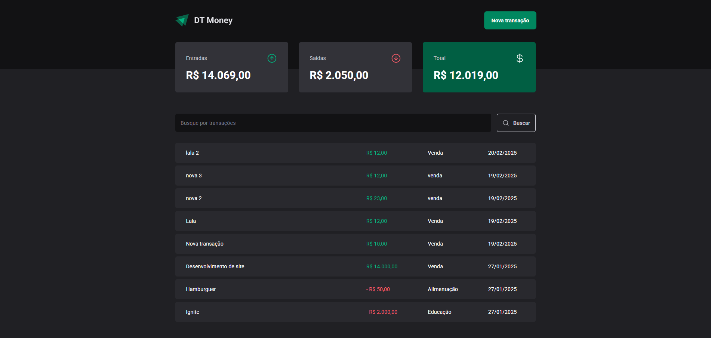
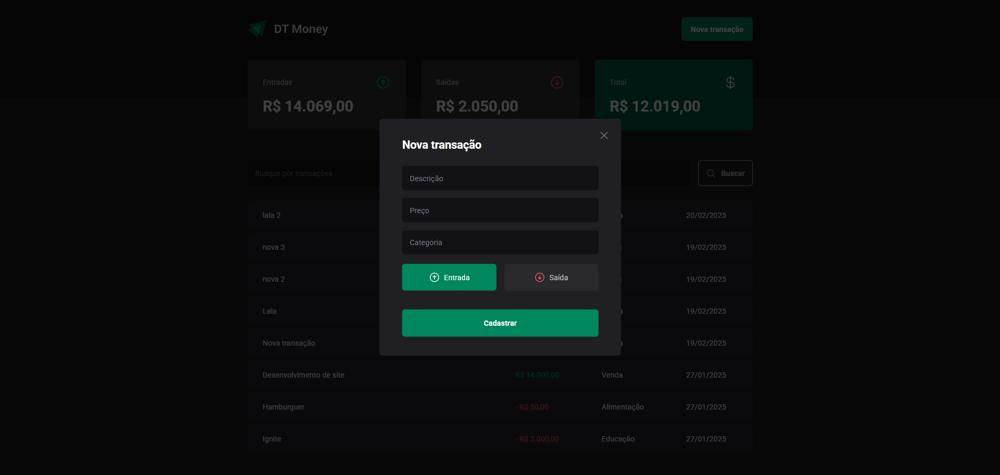
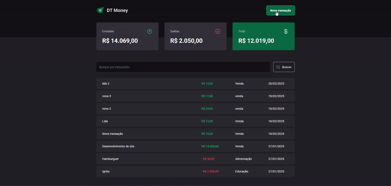

# 🚀 Ignite Rocketseat - Aprendizado em ReactJS e NodeJS  

Bem-vindo(a) ao meu repositório dedicado ao aprendizado de novas habilidades no Bootcamp da **Rocketseat**, o **Ignite**! Aqui você encontrará tudo sobre a minha jornada de estudo e prática com **ReactJS** e **NodeJS**, incluindo projetos desenvolvidos, tecnologias utilizadas e muito mais.  

---

## 📖 Sumário  

- [📚 Sobre o Bootcamp](#-sobre-o-bootcamp)  
- [🛠️ Tecnologias](#️-tecnologias)  
- [📂 Projetos Desenvolvidos](#-projetos-desenvolvidos)  
- [📬 Contato](#-contato)  

---

## 📚 Sobre o Bootcamp  

O Ignite da **Rocketseat** é uma experiência imersiva de aprendizado, focada nas tecnologias mais utilizadas no mercado. Durante este programa, estou aprofundando meus conhecimentos em:  

- **ReactJS**: Desenvolvimento de interfaces modernas e dinâmicas.  
- **NodeJS**: Construção de APIs robustas e escaláveis.  

Além disso, estou explorando práticas modernas de desenvolvimento, como:  
- Componentização.  
- Hooks no React.  
- ORM com Prisma.  
- Consumo de APIs REST e GraphQL.  

---

## 🛠️ Tecnologias  

Durante o bootcamp, estou utilizando as seguintes tecnologias:  

- **Frontend**  
  - ReactJS  
  - Vite  
  - Styled-Components  
  - Axios  

- **Backend**  
  - NodeJS  
  - Express  
  - Prisma  
  - PostgreSQL  

- **Ferramentas e Outras**  
  - Visual Studio Code  
  - Docker  
  - Insomnia/Postman  
  - Git e GitHub  

---

## 📂 Projetos Desenvolvidos  

Aqui estão os projetos que estou desenvolvendo ao longo do bootcamp:  

### 📝 **Projeto 1: Ignite Feed**  
**Descrição**: Um projeto que simula um feed de rede social onde você pode fazer comentários sobre os posts de outros usuários
- **Tecnologias**: ReactJS, UseStates, css modules, date-fns.  
- ✅ ReacJS.  
- ✅ UseStates.  
- ✅ Css modules.  
- ✅ Date fns.  
- ✅ TypeScript.  

**Imagens:**

### 📝 **Projeto 2: Ignite Timer**
**Descrição**: Esse projeto é sobre um cronômetro onde você pode cadastrar atividades que serão realizadas no tempo estipulado. Você também pode verificar seu histórico de atividades realizadas bem como seu status.

**Tecnologias**:
- ✅ React Hook Form
- ✅ Date FNS
- ✅ Immer
- ✅ React Router Dom
- ✅ Styled Components
- ✅ Zod
- ✅ ESlint
- ✅ TypeScript
- ✅ Cotexts
- ✅ Reducers

**Imagens**

### 📝 **Projeto 2: DT Money**
**Descrição**: Este projeto tem como objetivo facilitar a organização financeira do usuário, permitindo o registro e o acompanhamento de suas receitas e despesas. As principais funcionalidades incluem: cálculo automático do saldo total, cadastro de novas transações com detalhes como valor, categoria e descrição, além de um sistema de filtragem para visualizar transações de forma mais eficiente.

**Tecnologias**:
- ✅ React Hook Form
- ✅ Date FNS
- ✅ Immer
- ✅ React Router Dom
- ✅ Styled Components
- ✅ Zod
- ✅ ESlint
- ✅ TypeScript
- ✅ Cotexts
- ✅ Reducers
- ✅ RadixUI
- ✅ Json Server
- ✅ Use Context Selector
- ✅ useMemo
- ✅ useCallback

**Imagens**

_Sinta-se à vontade para explorar as pastas de cada projeto para mais detalhes!_  

## 📬 Contato  

Se quiser acompanhar mais sobre minha jornada ou trocar ideias, você pode me encontrar aqui:  

- **GitHub**: [Washington-coder](https://github.com/Washington-coder)  
- **LinkedIn**: [Washington Riega](https://www.linkedin.com/in/washington-riega/)  
- **E-mail**: was.antonio.xy@gmail.com 

---

✨ _"Nunca considere o estudo como uma obrigação, mas como uma oportunidade de mergulhar no belo mundo do saber."_  - Albert Einstein
